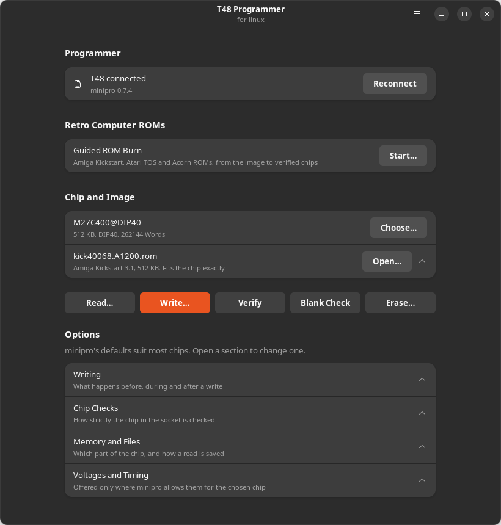
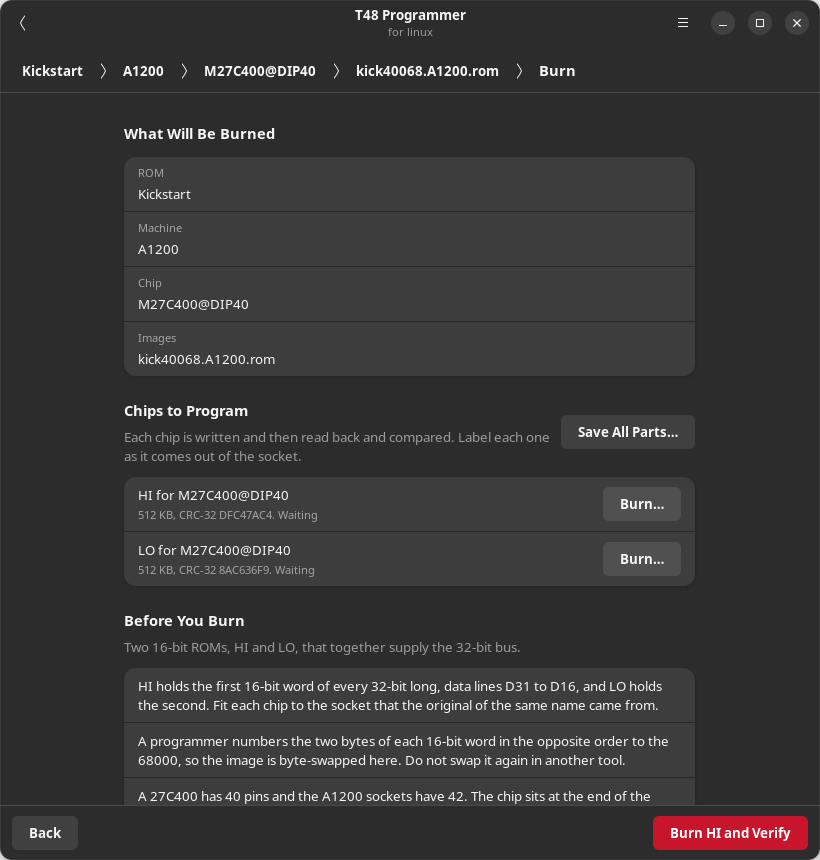
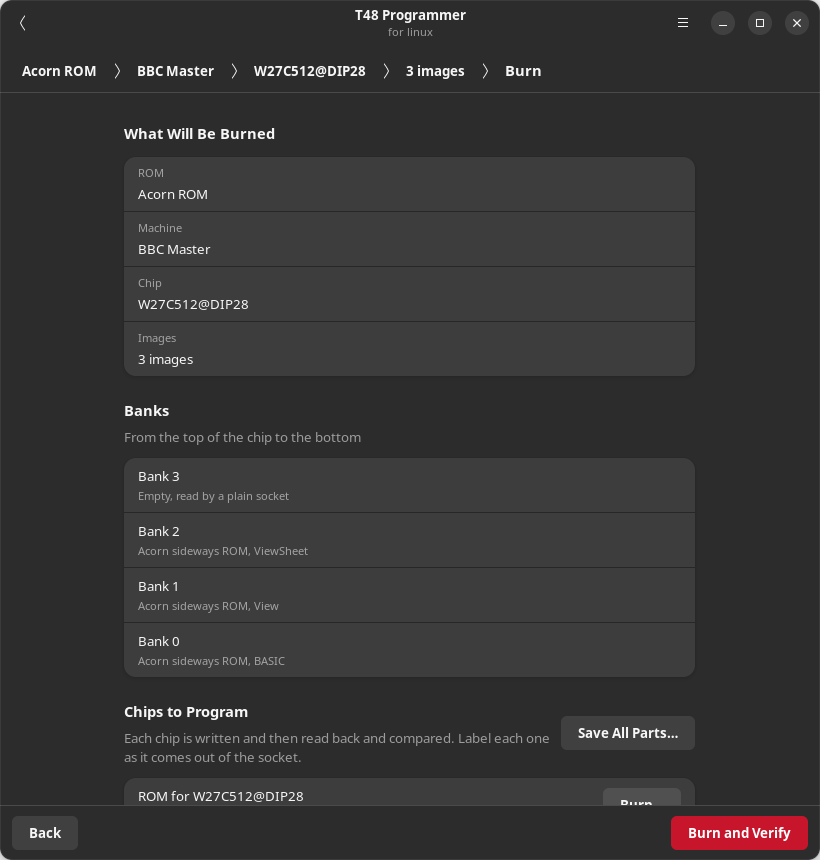
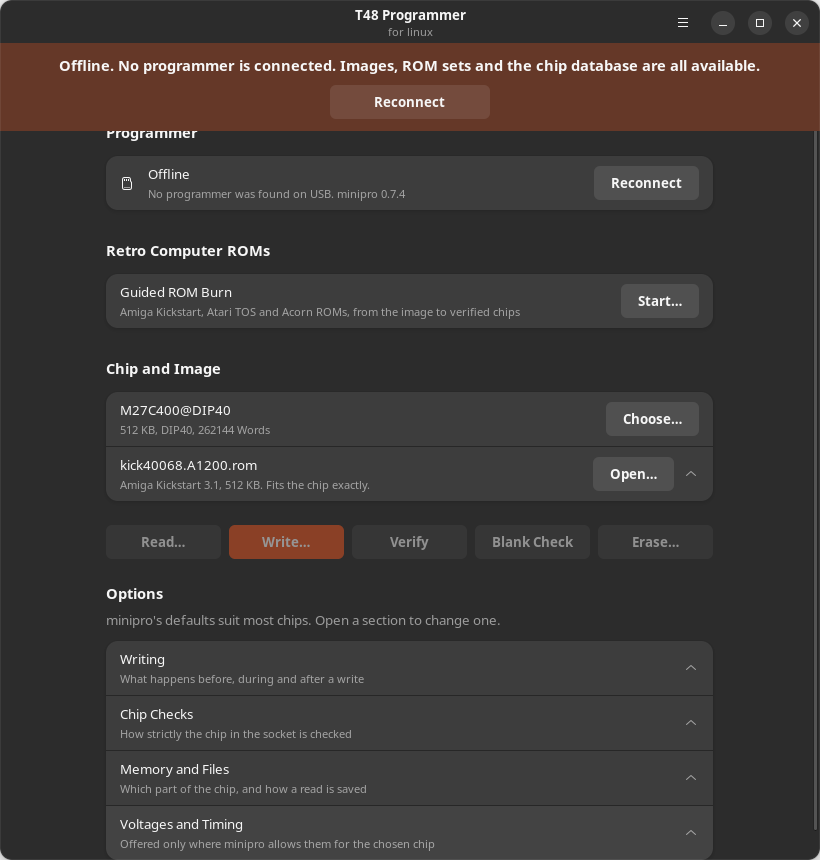

# T48 Programmer

## for linux

A native GNOME application for reading, writing and verifying EPROMs, EEPROMs,
flash and microcontrollers with an XGecu T48 programmer. All of the work on the
chip is done by [minipro](https://gitlab.com/DavidGriffith/minipro). This
application chooses minipro's arguments, follows its progress, explains its
results, and adds the image handling that a retro computer ROM needs before it
can be burned.



The current application:

- finds the programmer at startup and watches for it being unplugged or
  connected while the start page is showing;
- offers every device in minipro's database for the connected programmer, some
  28,000 names for the T48, through a search that accepts any part of the name;
- reads a chip to a raw binary, Intel HEX or Motorola S-record file;
- writes an image with erase and verification, and asks first, naming the chip
  and the image;
- verifies a chip against an image, blank checks it, erases it, and reads its
  ID;
- exposes every minipro option: programming, write and verify voltages, pulse
  width, SPI clock, memory section, size mismatch policy, protection, ID
  checks, and in-circuit programming;
- takes the voltages and clocks it offers from minipro for the chosen chip, so
  a value minipro would refuse cannot be selected;
- passes each option only to the operations that accept it, so a programming
  voltage chosen for a write never reaches a read;
- identifies Amiga Kickstart, Atari TOS and Acorn sideways ROM images, tests a
  Kickstart checksum, and warns about an image that is encrypted or already
  byte-swapped;
- says before a write whether the image fits the chip;
- guides a retro computer ROM from the image to verified chips: it asks which
  ROM, machine, chip and image, shows the answers as breadcrumbs that can be
  pressed to change them, then splits the image across HI and LO chips, cuts it
  into banks, byte-swaps it for a 16-bit EPROM, fills the chip, and burns and
  verifies each chip in turn;
- puts several Acorn ROMs in one chip, in 16 KB banks, and shows what each bank
  holds;
- decrypts an Amiga Forever Kickstart with its rom.key, and accepts the key
  only if the result passes the Kickstart checksum;
- tests 74-series and 4000-series logic and static RAM, detects 25-series SPI
  flash by its JEDEC ID, and runs the programmer's self test;
- shows live progress for every stage and cancels safely, asking first when
  the chip would be left half written;
- explains minipro's failures in plain terms and keeps its exact output in a
  diagnostic log;
- works offline, with a banner that says so, for everything that does not need
  the programmer, and comes back online when one is connected; and
- includes a user guide, opened with F1.

## Status

Version 0.1.0 has been developed against minipro 0.7.4. Its parsers are tested
against text captured from that release, and the whole chain from the window to
the process is tested against a simulator that reproduces minipro's behaviour,
including its carriage-return progress line and its exit statuses.

It has not yet been run against a physical T48. The first session with real
hardware should start with a read of a known chip, compared by CRC-32 against a
known image, before anything is written. minipro itself describes its T48
support as mostly complete. Its pin contact test is implemented for the
TL866II+ and the T76 only, and the application says so when it is asked for on
a T48.

The TL866A, TL866CS, TL866II+, T56 and T76 are detected and driven in the same
way, because minipro presents them identically, but the T48 is the target.

## Installing

See [docs/INSTALLATION.md](docs/INSTALLATION.md). In short, the Debian package
contains the application, minipro 0.7.4 built from source, its chip database,
and the udev rules that let you use the programmer without root:

```sh
sudo apt install ./t48-programmer_0.1.0_amd64.deb
```

To run from a checkout, install PyGObject, GTK 4 and libadwaita from your
distribution, put `minipro` on your PATH, and start the launcher:

```sh
sudo apt install python3-gi gir1.2-gtk-4.0 gir1.2-adw-1
./t48-programmer
```

## Writing a chip

1. Press **Choose** and search for the exact part number printed on the chip.
   The package matters: `W27C512@DIP28` and `W27C512@PLCC32` are different
   entries.
2. Press **Open** and select the image. The start page identifies it and says
   whether it fits the chip.
3. Press **Write**, read the confirmation, and confirm.
4. Wait for the result page. A write that verifies has been read back from the
   chip and compared byte for byte.

A UV EPROM cannot be erased by the programmer. Erase it under an ultraviolet
lamp and run **Blank Check** before writing. Programming can only change a 1 to
a 0, so a write over old data fails verification.

The most expensive mistake is selecting the wrong chip, because the programming
voltage follows the selection. Read the part number from the chip itself.

## Guided ROM burn



**File, Guided ROM Burn**, or **Start** on the start page, takes a retro
computer ROM from the image to verified chips in one pass. It asks five things
in order, and each answer becomes a crumb at the top of the page. Press a crumb
to go back and change that answer. Whatever the change does not invalidate is
kept, so choosing a different chip does not lose the image.

1. **ROM.** Amiga Kickstart, Atari TOS, or an Acorn MOS, BASIC or sideways ROM.
2. **Machine.** The machines are grouped by the ROMs they take, which is not
   always how they are grouped by age.
3. **Chip.** The chips known to fit the socket, by the name minipro uses, or any
   other chip from the full search, whose size is checked against the board.
4. **Images.** One file. It is split, swapped and filled for you.
5. **Burn.** Every chip of the set with its label and checksum. **Burn and
   Verify** writes the next chip that is waiting, reads it back, compares it
   and marks it done. The guide always verifies. A chip that fails stays
   waiting with the reason beside it. **Save All Parts** writes the files to a
   folder instead.

| ROM | Machines | Image | Chips | What is done |
| --- | --- | --- | --- | --- |
| Kickstart | A500, A500 Plus, A600, A2000, CDTV | 256 KB or 512 KB | one 27C400 | byte-swapped, and a 256 KB image written twice |
| Kickstart | A1200, A3000, A4000 | 512 KB | two 27C400, HI and LO | split by 16-bit word, byte-swapped, each half written twice |
| TOS 1.0x | ST, STF, STFM, Mega ST with six ROM chips | 192 KB | six 27C256 | split into even and odd bytes, each cut into three banks |
| TOS 1.0x | ST, STF, STFM, Mega ST with two ROM chips | 192 KB | two 27C010 with pin adapters | split into even and odd bytes, remainder left erased |
| TOS 1.06 to 2.06 | STE, Mega STE | 256 KB | two 27C010 | split into even and odd bytes |
| Acorn | BBC Micro B and B+, Master, Electron | 8 KB or 16 KB each, or a 128 KB Master MOS | 8 KB to 256 KB | placed in 16 KB banks |

The A600 has one ROM, like the A500. It is the A1200 that has two. The A1000
loads Kickstart from disk and has no ROM socket to fill. The Acorn Atom is not
covered yet.

### Several Acorn ROMs in one chip



Acorn machines page their ROMs in 16 KB banks, so a 32 KB chip has room for
two, a 64 KB chip for four, and a 256 KB chip for sixteen. One image alone is
repeated into every bank and works in any socket. Add more and each takes the
next bank up from the bottom of the chip.

A plain BBC Micro socket holds the upper address pins high, so it reads the top
bank and nothing else. Different ROMs in one chip appear only where something
drives those pins: a switch, a ROM board, or a Master socket linked for 32 KB.
The last page shows what every bank holds, from the top of the chip down, and
marks the one a plain socket reads. The 128 KB and 256 KB parts have 32 pins
and need an adapter in a 28-pin socket.

### Encrypted Kickstarts

An encrypted Kickstart from Amiga Forever is decrypted with its `rom.key`. A key
beside the ROM is used without asking, and otherwise you are asked for it. A key
is accepted only if the result is a Kickstart whose checksum adds up, so a wrong
key cannot produce a chip full of noise. The ROM file is never changed. The
decrypted copy lives in a private temporary folder that is removed when the
window closes.

[docs/ROM_SETS.md](docs/ROM_SETS.md) explains why each step is needed and how
to add another board, which is one row in a table.

ROM images are not included and are not downloaded. Kickstart, TOS and the
Acorn ROMs belong to their owners.

## Offline mode



When no programmer answers, the application works offline and says so in a
banner on every page. Only the commands that need the hardware are disabled.
Opening and identifying images, checking them against a chip, taking a ROM
through the guide and saving its parts, searching the chip database, chip information and
the user guide all work as usual. On the last page of the guide the **Burn**
buttons are disabled and **Save All Parts** remains, so a set can be prepared on one
machine and burned on another.

The application looks for the programmer every few seconds while the start page
is showing, and **Reconnect** looks at once. When one answers, the banner goes
and the commands return with the chip and image still selected.

## Trying it without a programmer

The application contains a simulator that stands in for minipro. It keeps the
contents of an imaginary chip in a file, so a write followed by a read returns
what was written, and a second write over a used UV EPROM fails as it would on
the bench. The guide stands in for the person swapping chips, by giving the
simulator a blank one before each burn.

```sh
T48_PROGRAMMER_DEMO=1 ./t48-programmer
```

To use a particular minipro, such as one built from a checkout:

```sh
T48_PROGRAMMER_MINIPRO=/path/to/minipro ./t48-programmer
```

## Development

```sh
PYTHONPATH=src python3 -W error::ResourceWarning -m unittest discover -s tests -v
ruff check src tests tools
ruff format --check src tests tools
```

The interface tests drive the real window against the simulator and need a
display. They skip themselves without one, unless `T48_PROGRAMMER_REQUIRE_GTK=1`
is set, which is how CI makes sure they ran.

[docs/ARCHITECTURE.md](docs/ARCHITECTURE.md) describes how the code is divided,
[CONTRIBUTING.md](CONTRIBUTING.md) the rules for changes, and
[ROADMAP.md](ROADMAP.md) what is planned and what has been left out on
purpose. The screenshots in this file are drawn from the running window by
`tools/capture_screenshots.py`, so they can be regenerated whenever it changes.

## Licence

GPL-3.0-or-later, the same licence as minipro. minipro is the work of Valentin
Dudouyt, David Griffith and its contributors. Every operation on a chip is
theirs.
